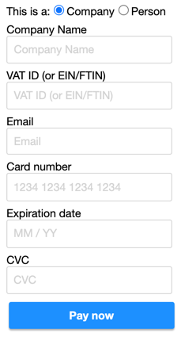
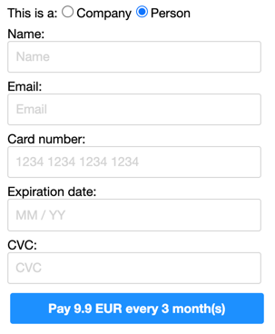
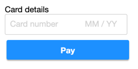

# React Zero-Config Payments

React payment components that require _zero_ configuration.

See also https://github.com/tomsoderlund/react-zeroconfig-components

## Design goals

- “Plug and play” Stripe integration – just drop a component into your project
- Great consumer UX – no redirects or popups
- VAT/tax compliant with European standards
- Simple backend requirements – basically just mirror Stripe’s API

## Features

- Payment systems:
  - [x] Stripe
    - [x] One-time payments
      - [ ] Support for stripePriceId/stripeProductId
      - [ ] Minimal form for returning customers (known stripeCustomerId)
    - [X] Recurring subscriptions
    - [ ] [VAT support](https://stripe.com/docs/api/customer_tax_ids/create?lang=node) and [tax rates](https://stripe.com/docs/api/subscriptions/create#tax_rates)
    - [ ] Field `metadata` on one-time payments (now only subscriptions)
    - [x] UX: Select either “one row” or “split fields” layout (merge StripeMethodCardForm*)
    - [x] Klarna payments
  - [ ] Paddle
  - [ ] ChargeBee
- [x] API mockup on http://localhost:6007/api/stripe (see [“Example server backend”](#example-server-backend) below)
- UX:
  - [ ] Disable form until subscriptions are completed (`inProgress`)
- Accessibility:
  - [x] All components use `button` where applicable
  - [x] Keyboard/tab support
- Documentation:
  - [ ] Storybook site published to GitHub Pages

## Installation

    yarn add react-zeroconfig-payments  # or: npm install react-zeroconfig-payments

### Configuration

Create an `.env` file for testing (see `.env.example`).

### Set up server routes

Required routes for `StripePaymentCardForm` and `StripeSubscriptionCardForm` (note: you can override the `/api/stripe` bit with the `apiPathRoot` prop on the React components):

- POST `/api/stripe/customers`
- POST `/api/stripe/customers/:id`

Required routes for `StripePaymentCardForm`:

- POST `/api/stripe/payment_intents`
- POST `/api/stripe/payment_intents/:id`

Required routes for `StripeSubscriptionCardForm`:

- POST `/api/stripe/payment_methods/:id`
- POST `/api/stripe/subscriptions`
- POST `/api/stripe/subscriptions/:id`

See [“Example server backend”](#example-server-backend) below.

## Components

See the Storybook stories in `/stories` to see how the components are used in code, including more advanced use cases.

Naming convention: [Provider][Action][Method]Form

- Provider: Stripe, Paddle
- Action: Payment (one-time), Subscription
- Method: Card, Klarna

### StripePaymentCardForm

This is the main component for **one-time payments**. It uses `StripeMethodCardForm` and `ContactInfoForm`.

**Note:** this component uses Stripe server API, it requires [backend routes](#set-up-server-routes).

    import { StripePaymentCardForm } from 'react-zeroconfig-payments'
    
    <StripePaymentCardForm
      stripeAppPublicKey={process.env.STRIPE_APP_PUBLIC_KEY}
      amountDecimals={9.90}
      currency='eur'
      onResponse={({ paymentIntent, error }) => {...}}
    />

### StripeSubscriptionCardForm

This is the main component for **recurring subscriptions**. It uses `StripeMethodCardForm` and `ContactInfoForm`.

**Note:** this component uses Stripe server API, it requires [backend routes](#set-up-server-routes).

    import { StripeSubscriptionCardForm } from 'react-zeroconfig-payments'
    
    <StripeSubscriptionCardForm
      stripeAppPublicKey={process.env.STRIPE_APP_PUBLIC_KEY}

      stripePriceId='price_XXXX'

      metadata={{ flavor: 'banana' }}
      onResponse={({ id, error }) => {...}}
    />

or:

    <StripeSubscriptionCardForm
      stripeAppPublicKey={process.env.STRIPE_APP_PUBLIC_KEY}

      stripeProductId='prod_XXXX'
      interval='month'
      intervalCount={1}
      amountDecimals={9.90}
      currency='eur'

      metadata={{ flavor: 'banana' }}
      onResponse={({ id, error }) => {...}}
    />

### StripeMethodKlarnaForm

This is a special version of the `StripeMethodCardForm` for Klarna payments. There’s also a `StripePaymentKlarnaForm` that includes fields for contact information.

**Note:** this component uses Stripe server API, it requires [backend routes](#set-up-server-routes).

    import { StripeMethodKlarnaForm } from 'react-zeroconfig-payments'

    <StripeMethodKlarnaForm
      stripeAppPublicKey={process.env.STRIPE_APP_PUBLIC_KEY}
      stripeCustomerId={process.env.STRIPE_CUSTOMER_ID}
      contactInfo={{
        // See https://stripe.com/docs/api/payment_methods/object#payment_method_object-billing_details for all fields
        email: 'john.doe@tomorroworld.com',
        address: {
          country: 'se',
          postal_code: '11350'
        }
      }}
      amountDecimals={99.00}
      currency='sek'
      onResponse={handleResponse}
      returnUrl='http://localhost:6007/api/klarna/return_url'
    />

Extra props needed:

- `contactInfo`: Klarna needs at least email and country. Also, country needs to match the currency.
- `returnUrl`: where to redirect after completing/cancelling the Klarna checkout screen (a simple test page is set up on http://localhost:6007/api/klarna/return_url)

### StripeMethodCardForm

This component is client-side only, does not require backend routes.

    <StripeMethodCardForm
      stripeAppPublicKey={process.env.STRIPE_APP_PUBLIC_KEY}
      onResponse={({ paymentMethod, error }) => {...}}
    />

#### StripeMethodCardForm: oneRow

    <StripeMethodCardForm
      oneRow={true}
      stripeAppPublicKey={process.env.STRIPE_APP_PUBLIC_KEY}
      onResponse={({ paymentMethod, error }) => {...}}
    />

## Stripe payment flow

One-time payments (https://dashboard.stripe.com/payments):

1. Create a Stripe customer
1. Create a payment intent
1. Get payment method from the browser (credit card or Klarna checkout)
1. Confirm card payment

Subscriptions (https://dashboard.stripe.com/subscriptions):

1. Create a Stripe customer
1. Get payment method from the browser
1. Set up the payment method on Stripe
1. Create a subscription

## Example server backend

Mock API running inside Storybook. See the source code in `stories/_helpers/server/stripeServer.js`.

Example API call:

    curl -X POST -H 'Content-type: application/json' --data '{ "amount": 100 }' http://localhost:6007/api/stripe/payment_intents

NOTE: you need to restart `yarn dev` if you modify `stripeServer.js`.

## Styling

Styling is optional, you can use `styled-components` or similar.

## Developing components

### Create new component

    yarn new

### How to test and preview

Preview components in Storybook:

    yarn storybook

...then open http://localhost:6007/ in your browser.

Test components:

    yarn unit

### How to build and publish a new NPM package

    yarn publish  # yarn prepare (Babel) will be run automatically
