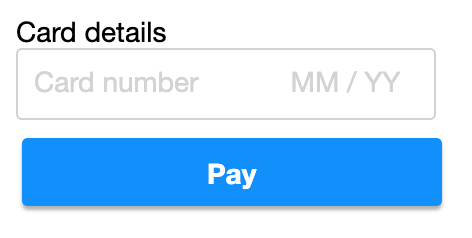

# React Zero-Config Payments

React payment components that require _zero_ configuration.

## Installation

    yarn add react-zeroconfig-payments  # or: npm install react-zeroconfig-payments

## Accessibility

- [x] All components use `button` where applicable
- [x] Keyboard/tab support

## Stripe

Uses https://github.com/stripe/react-stripe-js

See CodeSandbox: https://codesandbox.io/s/react-stripe-official-q1loc

### Stripe concepts

- PaymentIntent (ID prefix: `pi_`): customer’s intent to pay. Can change along the customer journey.
- PaymentMethod (ID prefix: `pm_`): e.g. a payment card.

### How to accept a payment

https://stripe.com/docs/payments/accept-a-payment

#### 1. Start payment process – create PaymentIntent (server)

    const paymentIntent = await stripe.paymentIntents.create({
      amount: 1000,
      currency: 'sek',
      payment_method_types: ['card'],
      receipt_email: 'jenny.rosen@example.com'
    })

Returns:

    {
      id: 'pi_1GGSK3AdCgUa7NQtInbwDOxY',
      client_secret: 'pi_1GGSK3AdCgUa7NQtInbwDOxY_secret_nwUxP04882diDN0hbumcNtCEl',
      ...
    }

Then `client_secret` is used in Step 3 below.

#### 2. Collect payment/card details – create PaymentMethod (client)

    const payload = await stripe.createPaymentMethod({
      type: 'card',
      card: elements.getElement(CardNumberElement)
    })

You get a PaymentMethod object back:

    {
      id: 'pm_1GGSAd2eZvKYlo2C7DhiKkSH',
      ...
    }

#### 3. Submit the payment to Stripe (client)

    stripe.confirmCardPayment(
      clientSecret,
      {
        // OR use PaymentMethod ID:
        // payment_method: 'pm_1GGSAd2eZvKYlo2C7DhiKkSH'
        payment_method: {
          card: card,
          billing_details: {
            name: 'Jenny Rosen'
          }
        }
      }
    )

`billing_details` object:

- billing_details
  - name
  - email
  - phone
  - address
    - postal_code

#### Error handling

Stripe methods return `{ error }` if something goes wrong.

## Styling

Styling is optional, CSS files are included but you can also use `styled-components` or similar.

How to import CSS file, example:

    import '../node_modules/react-zeroconfig-payments/dist/CardFormOneRow.css'

## Components

See the Storybook stories in `/stories` to see how the components are used in code, including more advanced use cases.

### CardFormOneRow

    <CardFormOneRow
      onSearch={async (searchText) => { return foundMatch }}
      onSubmit={handleSubmit}

      placeholder='Type here to search'
      canSubmitAny={true}
    />

## Events

- `onAdd`
- `onChange`
- `onClose`
- `onRemove`
- `onSearch`
- `onSelect`
- `onSubmit`

## Developing components

### Create new component

    yarn new

### How to test and preview

Preview components in Storybook:

    yarn storybook

...then open http://localhost:6006/ in your browser.

### How to build and deploy

    yarn publish  # yarn prepare (Babel) will be run automatically
