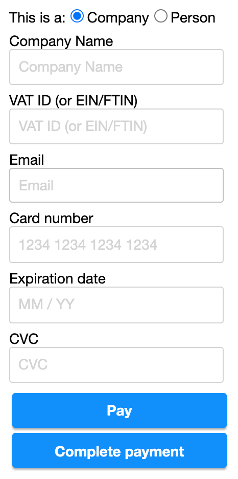

# React Zero-Config Payments

React payment components that require _zero_ configuration.

## Installation

    yarn add react-zeroconfig-payments  # or: npm install react-zeroconfig-payments

## Accessibility

- [x] All components use `button` where applicable
- [x] Keyboard/tab support

## Styling

Styling is optional, CSS files are included but you can also use `styled-components` or similar.

How to import CSS file, example:

    import '../node_modules/react-zeroconfig-payments/dist/PaymentForm.css'

## Components

See the Storybook stories in `/stories` to see how the components are used in code, including more advanced use cases.

### PaymentForm

    <PaymentForm
      onSearch={async (searchText) => { return foundMatch }}
      onSubmit={handleSubmit}

      placeholder='Type here to search'
      canSubmitAny={true}
    />

## Events

- `onAdd`
- `onChange`
- `onClose`
- `onRemove`
- `onSearch`
- `onSelect`
- `onSubmit`

## Developing components

### Create new component

    yarn new

### How to test and preview

Preview components in Storybook:

    yarn storybook

...then open http://localhost:6006/ in your browser.

### How to build and deploy

    yarn publish  # yarn prepare (Babel) will be run automatically
